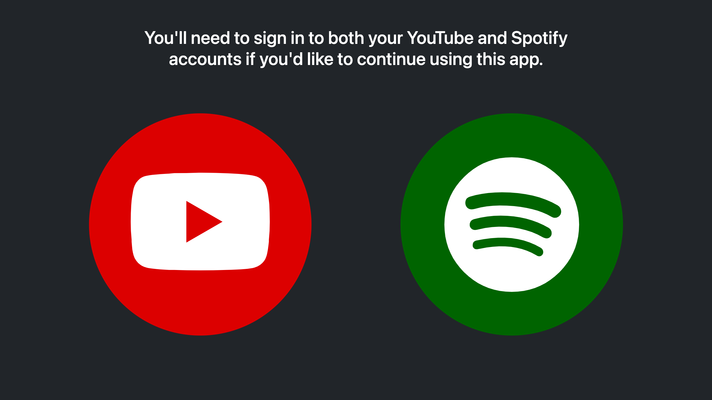
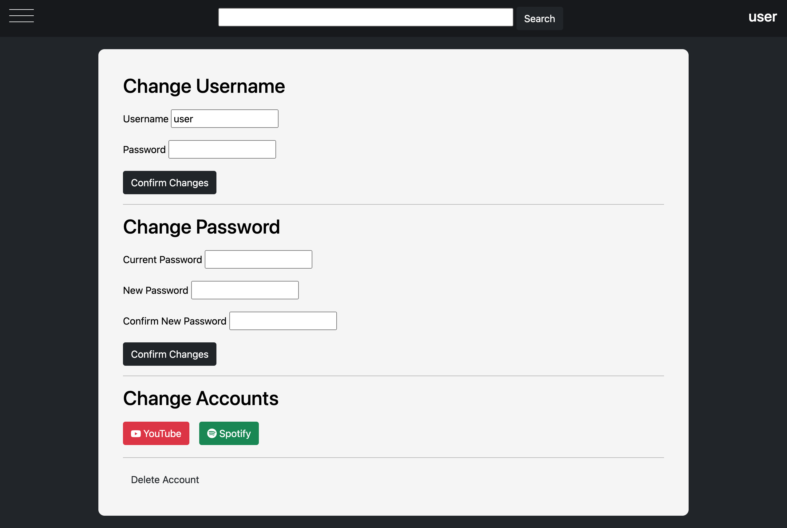
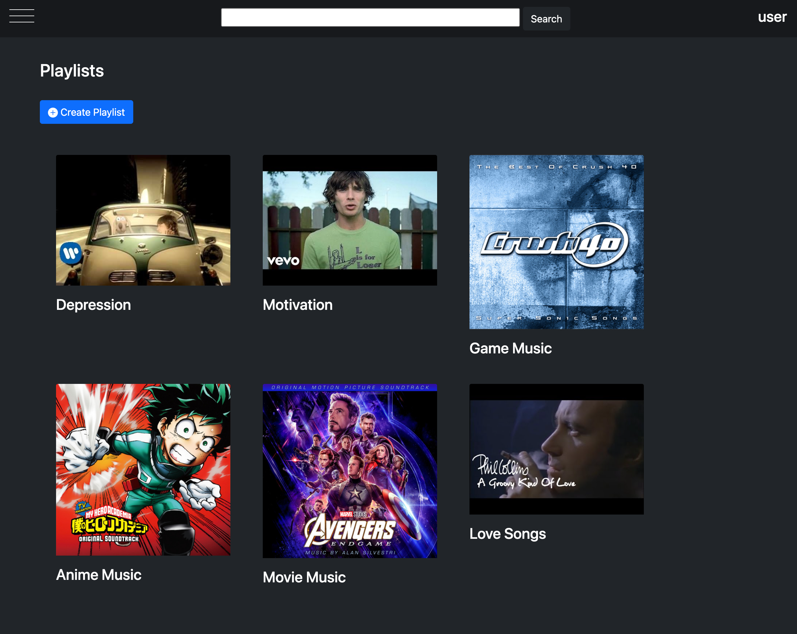
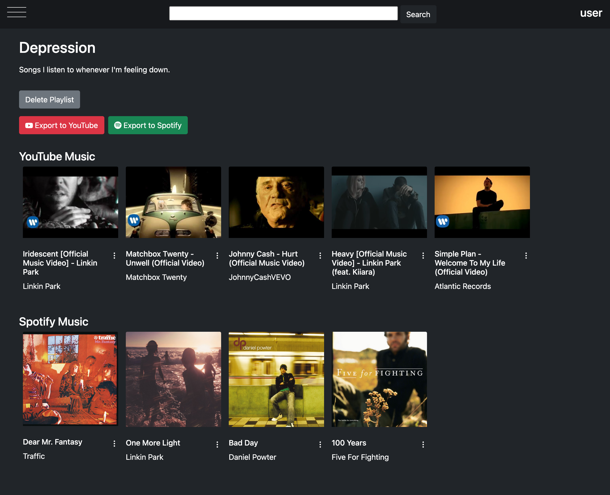
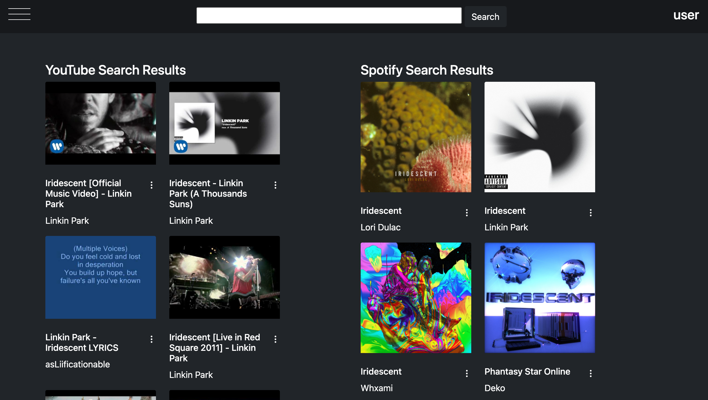
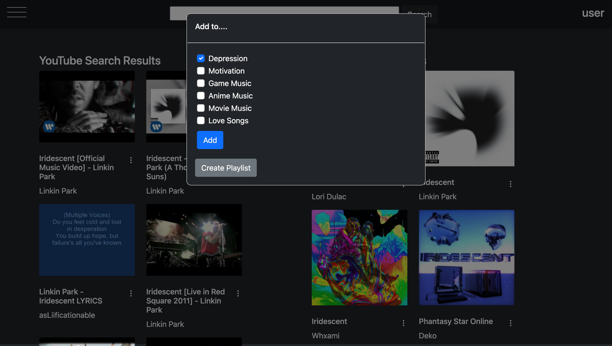
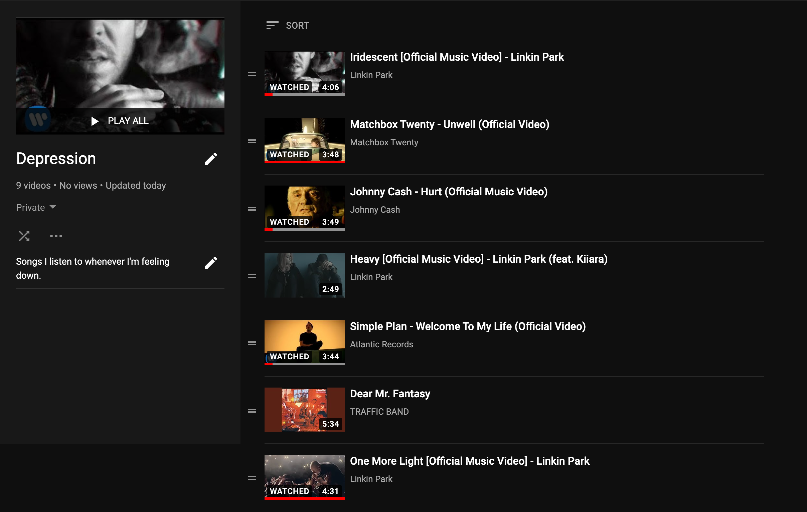

# User Documentation

## User Authentication

This app will make use of 3 different accounts:

* In-app Account
* YouTube Account
* Spotify Account

After logging into this app, you *must* allow third-party access to your YouTube and Spotify account, otherwise you will not be able to access the rest of the application. All you'll see is this screen:

Keep in mind that when you login to this app through the in-app account, be sure to remember the username and password you set, as this app does not have a feature to recover your user information.  

 

After verifying your YouTube and Spotify accounts, you can always change your username, password, and associated YouTube or Spotify accounts at any time via the settings page.

## Features

### Creating and Viewing Playlists

You can create and view playlists within the app by going to the "Created Playlists" section of the app.

Each playlist can be viewed on their own page. From there you can choose to remove songs or videos, edit a playlist's title or description, or delete a playlist.

### Searching both Platforms

If you enter a search query, search results from both YouTube and Spotify will appear side-by-side.

Click the 3-dotted icon on any video or song and you can add them to any playlist(s) you choose. You can also create a new playlist at anytime too.

### Exporting Playlists

When viewing one of your playlists, you can choose to export them to either YouTube or Spotify. Once the playlist is exported, it will be deleted from the app.

Here's what a playlist exported to YouTube might look like:

Similarly, you can do the same for Spotify.

Keep in mind that, though the exporting feature of this app was optimized as much as possible, in some cases not all Spotify songs might be exported to YouTube properly, and vice versa.

 

## Limitations

Please be aware that due to YouTube's very small and limited quota, you won't be able to search content or export playlists to YouTube once the quota limit is reached. Should this happen, you will be logged out and unable to use the app for a certain period of time until the daily quota is refreshed.
