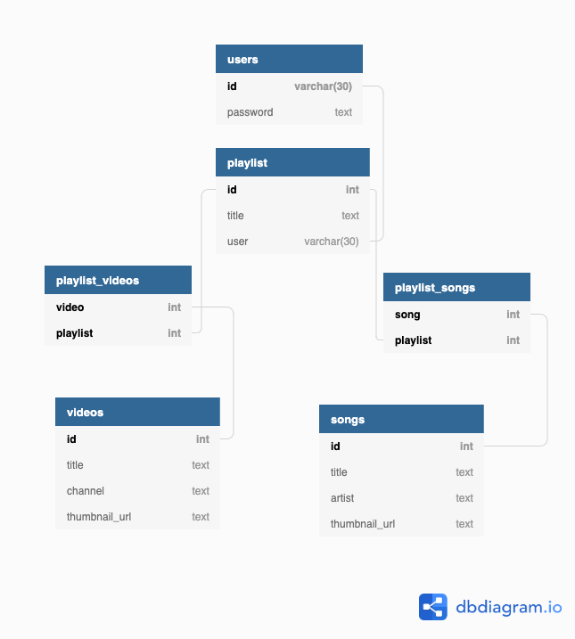

# YouTubeify

This web application integrates and combines the YouTube and Spotify APIs to allow users to
search, store, and export content on both platforms in created playlists.

## Signing In

In addition to a simple username/password feature specific for the web application itself,
OAuth will be utilized by both platforms requiring users to sign into both YouTube and Spotify
accounts before using the app. These accounts will be linked to the account they create in the
application. If the user does not authorize this application through both these platforms, they
will not be able to access any of the application's features.

## Searching for Content

Once the user has signed in and verified both their YouTube and Spotify accounts, they will be
directed to a homepage that will allow them to search for both videos and music from both platforms.
Any query the user inputs will display search results of videos from YouTube and songs from Spotify.

*(Note: Since the scope of this application is limited to music, only YouTube videos within the Music category will be displayed.)*

## Creating and Exporting Playlists

Users will be able to create playlists on their account made up of videos and songs from both platforms.
When searching for media, they can choose to add content to any playlist they have made. Once they have
populated a playlist with content, users can choose to export the playlist to either YouTube, Spotify,
or both.

## Schema

Here is the proposed schema that will be implemented in this web application. *(This may be subject to change.)*

